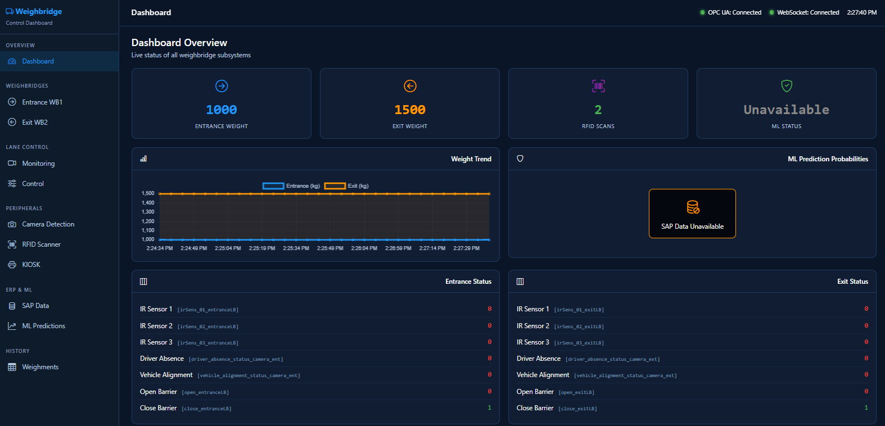

# Routine Manager

## Smart Weighbridge Automation Platform

Routine Manager is a modular industrial automation framework designed to manage and coordinate the complete workflow of a smart weighbridge installation. The system integrates industrial weighing equipment, OPC UA infrastructure, TCP-connected field devices, SAP transaction data, RFID systems, kiosk operations, and machine-learning based anomaly detection into a single orchestrated platform. A real-time Smart Dashboard provides browser-based visualization and control for all subsystems.



---

# Table of Contents

1. Introduction
2. System Architecture
3. Core Responsibilities
4. Project Structure
5. Runtime Components
6. Communication Layers
7. Weighbridge Integration
8. OPC UA Integration
9. TCP Device Integration
10. Machine Learning Pipeline
11. Smart Dashboard
12. Data Flow
13. State Management
14. Configuration
15. Installation
16. Development Workflow
17. Testing
18. Deployment Notes
19. Troubleshooting
20. Future Enhancements

---

# Introduction

The project acts as the central coordinator between multiple subsystems operating within a smart weighbridge environment.

The primary goals are:

- Continuous weight acquisition
- Equipment monitoring
- Industrial communication
- Process automation
- SAP transaction validation
- RFID and kiosk coordination
- ML-based anomaly detection
- OPC UA publishing for SCADA visibility
- Real-time web dashboard for visualization and remote control

The architecture is intentionally modular to allow independent development and testing of each subsystem.

---

# System Architecture

```text
                   SAP Transactions
                          |
                          v
+--------------------------------------------------+
|                  Routine Manager                 |
|--------------------------------------------------|
| Controller                                       |
| Scheduler                                        |
| State Manager                                    |
|--------------------------------------------------|
| Serial Layer     OPC UA Layer     TCP Layer      |
|--------------------------------------------------|
| ML Inference Engine                              |
+--------------------------------------------------+
      |                |                |
      v                v                v

 Weighbridge      OPC UA Server     Waveshare I/O
 Devices                              Devices

                          |
                          v
                     SCADA System
                          |
                          v
+--------------------------------------------------+
|                Smart Dashboard (Web)             |
|--------------------------------------------------|
| FastAPI Backend                                   |
| WebSocket Real-Time Push                          |
| Bootstrap 5 Single-Page Frontend                 |
+--------------------------------------------------+
      |                |                |
      v                v                v
  Browser         Mobile           Embedded
```

---

# Core Responsibilities

The application is responsible for:

- Polling weighbridge devices
- Parsing incoming serial data
- Maintaining process state
- Synchronizing field I/O
- Updating OPC UA variables
- Processing SAP transactions
- Running machine-learning predictions
- Publishing operational status
- Serving real-time dashboard data via WebSocket
- Exposing REST API for tag read/write operations

---

# Project Structure

```text
routine_manager/

├── config/
│   ├── system_config.json
│   └── tcp_payload.json
│
├── dashboard/
│   ├── app.py                          # FastAPI backend + WebSocket
│   ├── templates/
│   │   └── index.html                  # Single-page dashboard UI
│   └── requirements.txt                # Dashboard dependencies
│
├── docs/
│
├── sample/
│   ├── core/
│   │   ├── controller.py
│   │   ├── scheduler.py
│   │   ├── state_manager.py
│   │   └── localDB.py
│   │
│   ├── serialInterface/
│   │
│   ├── opcua/
│   │
│   ├── tcpClient/
│   │
│   ├── inferenceEngineML/
│   │
│   ├── modelsML/
│   │
│   └── utils/
│
├── tests/
│   ├── test7_sap_opc.py                # Main entry point (runs all subsystems)
│   └── ...
│
├── run_all.py                          # Launcher for project + dashboard
├── requirements.txt
├── setup.py
└── weighbridgeConfig.json              # OPC UA tag definitions
```

---

# Runtime Components

## Controller

Primary orchestration component.

Responsibilities:

- Startup initialization
- Device registration
- Communication setup
- Scheduler management
- Process coordination

The controller acts as the central entry point for the entire application.

---

## Scheduler

Responsible for recurring execution tasks.

Functions include:

- Serial polling
- Device health checks
- OPC updates
- TCP synchronization
- Scheduled processing jobs

Benefits:

- Deterministic execution
- Centralized polling
- Reduced communication conflicts

---

## State Manager

Central repository for runtime information.

Stores:

- Current weights
- Device status
- RFID information
- SAP transaction data
- Kiosk status
- Barrier state
- TCP payload data

The state manager allows modules to exchange information without direct coupling.

---

## Local Database

Provides persistent storage for:

- Transactions
- Historical records
- Runtime snapshots
- Offline buffering

Allows operation even when external systems are unavailable.

---

## Smart Dashboard (FastAPI + WebSocket)

A real-time web-based visualization and control interface.

Functions include:

- REST API for reading all OPC UA tags
- REST API for writing writable tags
- WebSocket push for live tag updates (0.5 s polling interval)
- Bootstrap 5 single-page frontend with sidebar navigation
- Dashboard overview with key metrics (weights, RFID count, ML status)
- Dedicated pages for each subsystem (Entrance, Exit, Lane, Camera, RFID, KIOSK, SAP, ML)

The dashboard runs as an independent process alongside the main project.

---

# Communication Layers

## Serial Communication Layer

Used for weighbridge communication.

Responsibilities:

- COM port management
- Command transmission
- Response handling
- Packet parsing
- Error recovery

Features:

- Multiple devices
- Independent connections
- Automatic reconnection

---

## OPC UA Layer

Industrial interoperability layer.

Capabilities:

- Read OPC UA nodes
- Write OPC UA nodes
- Namespace browsing
- Process variable publishing

Used for:

- SCADA visibility
- Automation integration
- Third-party connectivity
- Dashboard data source

---

## TCP Layer

Responsible for communication with external network devices.

Capabilities:

- Client connections
- JSON payload transfer
- Heartbeat monitoring
- Automatic reconnect

Primary use:

- Waveshare ESP32-S3 communication

---

## WebSocket Layer (Dashboard)

Real-time data push layer for the Smart Dashboard.

Capabilities:

- Persistent bidirectional connection
- JSON-encoded tag value updates
- Automatic reconnection on disconnect
- 500 ms polling interval for OPC UA changes

Used for:

- Live dashboard updates without page refresh
- Real-time visualization of weight changes, sensor states, and ML predictions

---

# Weighbridge Integration

Supported equipment includes XK3190 DS8 weighbridge indicators.

Typical workflow:

1. Open serial connection
2. Poll weight value
3. Parse response
4. Validate data
5. Update state manager
6. Publish to OPC UA

Collected values:

- Gross weight
- Tare weight
- Net weight
- Device status

Dashboard displays entrance weight in blue and exit weight in orange for quick visual differentiation.

---

# OPC UA Integration

The OPC UA subsystem exposes process information to external systems.

Example information published:

- Current weight
- Vehicle status
- Barrier state
- RFID information
- Transaction state
- ML prediction results

The dashboard reads all tags from the same OPC UA server for real-time display.

OPC UA server details:

- Endpoint: `opc.tcp://127.0.0.1:5501/pso/weighbridge/`
- Namespace URI: `urn:pso:smart-weighbridge`
- Server object: `PSO Smart Weighbridge`

Benefits:

- Vendor-neutral communication
- SCADA compatibility
- Standardized industrial integration
- Single data source for dashboard and SCADA

---

# TCP Device Integration

The TCP client subsystem manages communication with Waveshare devices.

Typical functions:

- Sensor monitoring
- Digital inputs
- Digital outputs
- Status synchronization
- Command execution

Features:

- Reconnect handling
- Connection monitoring
- Payload validation

---

# Machine Learning Pipeline

The repository contains a dedicated ML inference engine.

Model artifacts:

```text
modelsML/
├── xgboost_trailer_model.pkl
└── label_encoder.pkl
```

## Workflow

```text
SAP Data
   |
   v
Feature Builder
   |
   v
Buffer Manager
   |
   v
XGBoost Model
   |
   v
Prediction
   |
   v
OPC UA Publication
   |
   v
Dashboard Visualization
```

## Prediction Categories

- NORMAL
- DRIFT
- THEFT
- MISSING

Potential use cases:

- Trailer anomaly detection
- Transaction verification
- Fraud detection
- Operational analysis

Dashboard behavior when SAP data is unavailable:

- Overview ML card shows "Unavailable" in grey
- ML probability bars are replaced with "SAP Data Unavailable" badge
- ML Predictions page shows blurred/disabled cards with overlay message

---

# Smart Dashboard

## Overview

The Smart Dashboard is a browser-based real-time visualization and control interface for the weighbridge system. It connects to the same OPC UA server that the main application publishes to, and displays live data across all subsystems.

- **Framework:** FastAPI (backend), Vanilla JS + Bootstrap 5 (frontend)
- **Real-time:** WebSocket push (500 ms poll interval)
- **API:** REST endpoints for reading/writing tags
- **Port:** `http://localhost:8000`

## Dashboard Pages

### Overview

- Entrance weight (blue) and exit weight (orange) live display
- Active RFID count
- ML predicted case status
- Compact entrance/exit status panels (IR sensors, driver absence, vehicle alignment, barrier control)
- ML probability summary bars

### Entrance WB1 / Exit WB2

- Gross weight display (large font)
- Device configuration parameters
- Full tag list with values

### Lane Monitoring

- IR sensor states for entrance and exit
- Light barrier status
- Complete tag table

### Lane Control

- ON/OFF bypass controls for barrier open/close commands
- Full tag list

### Camera Detection

- Driver absence and vehicle alignment status for both lanes
- ON/OFF bypass controls (writable tags)

### RFID Scanner

- Entrance and Exit RFID data with text-input bypass (SET button)
- Scan status indicators

### KIOSK

- Button ON/OFF bypass controls
- Card data text-input bypass (SET button)
- Print control ON/OFF bypass
- Receipt data section with tag names/values on one side and white-background receipt preview with "PSO" title on the other

### SAP Data

- Trailer information, quantities, timing, and compartment details

### ML Predictions

- Predicted case display (color-coded: green=Normal, red=Theft, yellow=Drift, purple=Missing)
- Probability bars for each prediction category
- Cards are blurred with overlay when SAP data is unavailable

### Weighments

- Historical weight chart (entrance vs. exit) using Chart.js
- Real-time chart updates

## Graceful Degradation

The dashboard handles missing subsystems gracefully:

- **OPC UA server offline:** All tags show `--`, dashboard continues retrying
- **SAP data unavailable:** ML sections show disabled/blurred state with "SAP Data Unavailable" badge; no probability values displayed
- **Missing specific tags:** Individual tag values display `--` without breaking other sections

## Writing Tags

Writable tags can be modified directly from the dashboard:

- **Toggle controls (ON/OFF):** Barrier open/close, camera detection status, KIOSK buttons, print control
- **Text input + SET button:** RFID data, KIOSK card data
- Writes are sent via `POST /api/tag/{category}/{tag}` with `{value: ...}` JSON body

---

# Data Flow

## Weighbridge Data

```text
Weighbridge
     |
     v
Serial Client
     |
     v
Parser
     |
     v
Scheduler
     |
     v
State Manager
     |
     v
OPC UA
     |
     v
SCADA  +  Dashboard (WebSocket)
```

## SAP + ML Data

```text
SAP Transaction
       |
       v
Feature Builder
       |
       v
Inference Engine
       |
       v
Prediction
       |
       v
OPC UA
       |
       v
Dashboard Visualization
```

---

# State Management

The State Manager acts as the shared memory layer of the application.

Example categories:

- Device states
- Weight values
- Sensor values
- SAP records
- RFID events
- Kiosk workflow state
- ML outputs

Advantages:

- Centralized data ownership
- Reduced module coupling
- Easier debugging

---

# Configuration

## system_config.json

Contains:

- Device definitions
- COM ports
- Baud rates
- OPC UA settings
- TCP settings
- Polling parameters

## weighbridgeConfig.json

Defines all OPC UA tag categories, names, and writable status used by the dashboard.

Categories include:

- Entrance_XK3190_DS8
- Exit_XK3190_DS8
- Waveshare_Monitoring
- Waveshare_Controlling
- Camera_Detection
- RFID_Scanner
- KIOSK
- SAP_DATA

## tcp_payload.json

Defines the TCP payload structure exchanged with external devices.

Important:

Changes to payload structures should remain synchronized with firmware implementations.

---

# Installation

## Clone Repository

```bash
git clone https://github.com/hsm-0510/routine_manager.git
cd routine_manager
```

## Install Dependencies

```bash
pip install -r requirements.txt
```

## Install Dashboard Dependencies

```bash
pip install -r dashboard/requirements.txt
```

## Install Package

```bash
pip install -e .
```

---

# Running

## Start All Components

```bash
python main.py
```

This launches:

1. Main weighbridge application (`python -m tests.test7_sap_opc`)
2. Smart Dashboard (`uvicorn dashboard.app:app --host 0.0.0.0 --port 8000`)

## Start Dashboard Only

```bash
uvicorn dashboard.app:app --host 0.0.0.0 --port 8000 --reload
```

Access the dashboard at `http://localhost:8000`.

---

# Development Workflow

Recommended workflow:

```bash
git checkout -b feature/new-feature
```

Implement changes.

Run tests.

Commit changes.

Create pull request.

---

# Testing

The repository includes test modules covering:

- Serial communication
- Parser validation
- TCP communication
- OPC UA integration
- Multi-device scenarios
- SAP integration

Testing goals:

- Communication validation
- Regression prevention
- Integration verification

---

# Deployment Notes

Recommended production environment:

- Windows Industrial PC or Linux Industrial PC
- Dedicated serial ports
- Reliable OPC UA infrastructure
- Stable network connectivity
- Local database backup strategy

Operational recommendations:

- Enable logging
- Monitor device health
- Validate OPC UA connectivity
- Backup configuration files
- Ensure dashboard port (8000) is accessible on local network

---

# Troubleshooting

## No Weighbridge Data

Check:

- COM port
- Baud rate
- Cable connection
- Device power

## OPC UA Not Updating

Check:

- OPC UA endpoint
- Namespace configuration
- Firewall settings

## Dashboard Shows All Dashes

Check:

- OPC UA server is running
- Dashboard port is not blocked by firewall
- `weighbridgeConfig.json` tag names match server

## TCP Device Offline

Check:

- Device IP
- Network connectivity
- Firewall rules

## ML Prediction Errors

Check:

- Model files exist
- Feature generation logic
- Input data integrity
- SAP data availability in OPC UA server

## Dashboard WebSocket Disconnected

Check:

- Dashboard process is running
- No reverse proxy timeout
- Browser console for errors

---

# Future Enhancements

Potential roadmap:

- MQTT integration
- Docker deployment
- Multi-site synchronization
- Predictive maintenance analytics
- Historical data persistence in dashboard
- User authentication for dashboard
- Dark/light theme toggle
- Mobile-responsive dashboard refinements
- Export weighment reports (PDF/CSV)
- Alarm and notification system

---

# License

Refer to the repository license information for licensing terms and usage restrictions.
